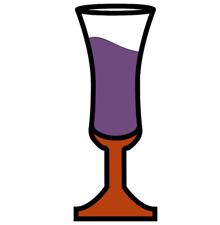

#  Cordial

Elixir RPC framework.

[Examples](./examples) | [Guides](./guides)

## Roadmap

The following functionality is planned or under development:

- [ ] Client
  - [ ] gRPC
  - [ ] HTTP
- [ ] Server
  - [ ] gRPC
  - [ ] HTTP
- [ ] Schema definitions
  - [ ] Protocol buffer (inc. gRPC)
  - [ ] OpenAPI 3
- [ ] `mix cordial.new` project setup command.
- [ ] Add examples
- [ ] Add guides
